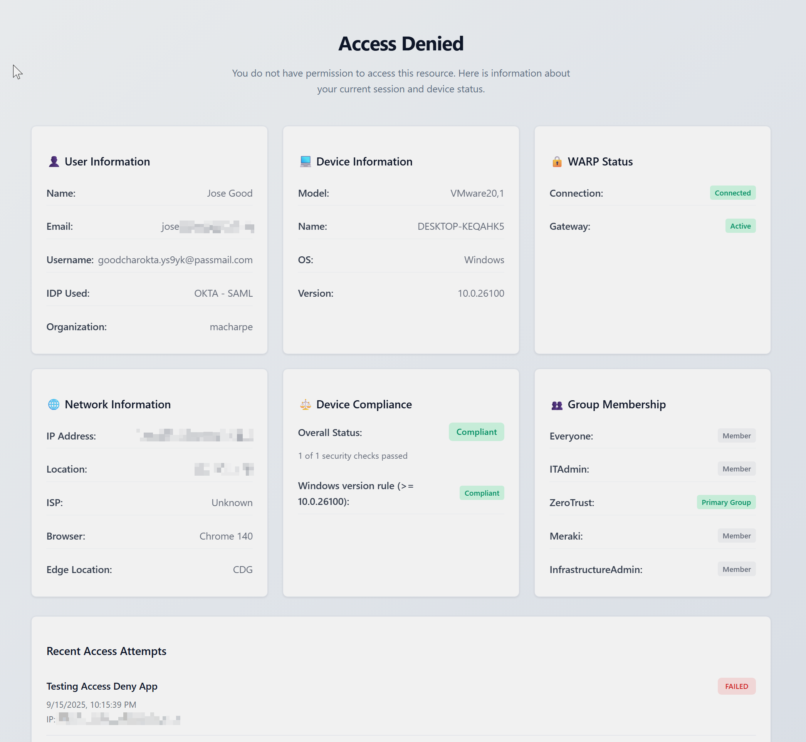
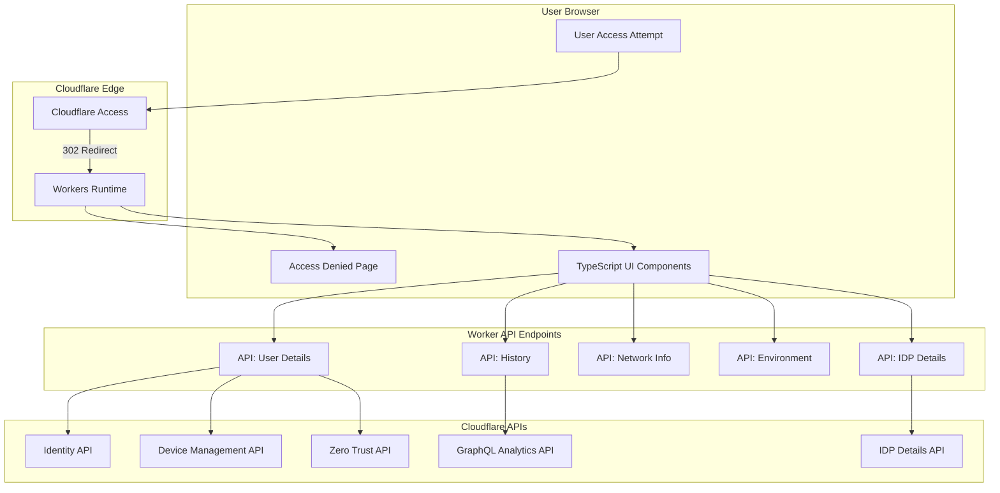
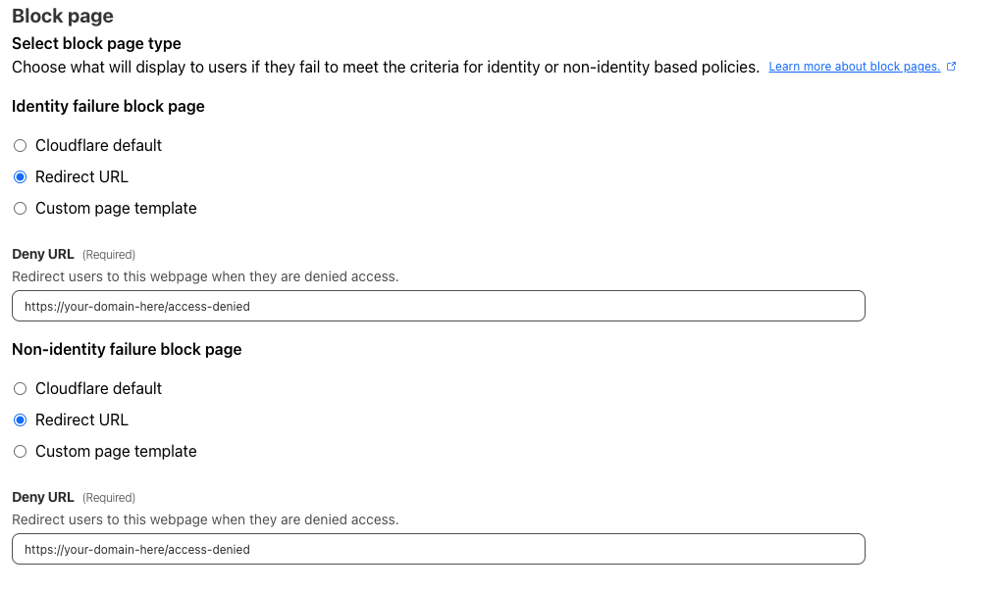

# 🛡️ Cloudflare Access Denied Information Page

[](https://deploy.workers.cloudflare.com/?url=https%3A%2F%2Fgithub.com%2Fmacharpe%2Fcloudflare-access-denied-info-page)

[](https://workers.cloudflare.com/)
[](https://www.typescriptlang.org/)
[](https://eslint.org/)
[](https://workers.cloudflare.com/)
[](https://www.gnu.org/licenses/gpl-3.0)

> **Note**: This project is based on and extends the original [cf-identity-dynamic](https://github.com/cloudflare/cf-identity-dynamic) repository by Cloudflare.

A professional, enterprise-grade access denied page built with **TypeScript** and **Cloudflare Workers** that provides enriched user feedback and comprehensive device posture information. This solution dynamically fetches user identity data and presents it in a modern, S-Tier design system compliant interface.

## ⚠️ Production Ready

**This project is production-ready** and has been tested with:

- ✅ **Windows machines** - Full device posture and compliance monitoring with expandable UI
- ✅ **macOS machines** - Complete device information and security checks
- ✅ **OKTA as Identity Provider** - Enhanced SAML authentication with provider name resolution
- ✅ **Azure AD/Entra ID** - OIDC integration support
- ✅ **Complete TypeScript** - Full type safety and modern development tooling
- ✅ **ESLint Integration** - Professional code quality and consistency

<div align="center">
  
  <p><em>Modern access denied page with real-time user and device information</em></p>
</div>

### 🎥 Live Demo

<div align="center">
  
  <p><em>Interactive demonstration showing dark mode toggle, expandable tiles, copy functionality, and modal popups</em></p>
</div>


## 🏗️ Architecture


```mermaid
graph TB
    subgraph "User Browser"
        A[User Access Attempt]
        B[Access Denied Page]
        C[TypeScript UI Components]
    end

    subgraph "Cloudflare Edge"
        D[Cloudflare Access]
        E[Workers Runtime]
    end

    subgraph "Cloudflare APIs"
        G[Identity API]
        H[Device Management API]
        I[GraphQL Analytics API]
        J[Zero Trust API]
        K[IDP Details API]
    end

    subgraph "Worker API Endpoints"
        L["API: User Details"]
        M["API: History"]
        N["API: Network Info"]
        O["API: Environment"]
        P["API: IDP Details"]
    end

    A --> D
    D -->|302 Redirect| E
    E --> B
    E --> C

    C --> L
    C --> M
    C --> N
    C --> O
    C --> P

    L --> G
    L --> H
    L --> J
    M --> I
    P --> K
```

## 🖥️ What the Page Shows

The denied page renders six diagnostic tiles loaded in parallel:

| Tile | Data source | Fields |
|---|---|---|
| 👤 **User Information** | `/api/userdetails` → identity | Name, Email, Username, IDP, Organization |
| 💻 **Device Information** | `/api/userdetails` → device | Device ID, Model, Name, OS, OS Version |
| 🌐 **Connection Status** | `/api/userdetails` → warpMode + client-side `/cdn-cgi/trace` | CF One Client Status, Gateway Status, RBI Status, Mode, Profile, Client Version, Service Mode, **CF One Client IPv4**, **CF One Client IPv6** |
| 🌐 **Network Information** | `/api/networkinfo` + `/cdn-cgi/trace` | Public IP, HTTP Protocol, Country, Region, City, Edge Location, Browser |
| ⚖️ **Device Compliance** | `/api/userdetails` → posture | Overall status, pass/fail counts, per-check results |
| 👥 **Group Membership** | `/api/userdetails` → identity.groups | All groups, TARGET_GROUP highlighted as "Primary Group" |

Plus a **Recent Access Attempts** history card showing the last failed login events with app name, timestamp, IP, and country.

### CF One Client Virtual IPs

The **Connection Status** tile displays the virtual IPv4 and IPv6 addresses assigned to the blocked device by Cloudflare One Client (formerly WARP). These are fetched server-side via:

```
GET /accounts/{account_id}/devices/registrations?device.id={device_id}&status=active
```

This uses the same `BEARER_TOKEN` with Zero Trust Read permission — no additional credentials required. The IPs are only shown when the device has an active CF One Client registration with virtual addresses assigned (i.e. the tunnel is enrolled). They are fetched in parallel with device details and posture checks, so there is no added latency.

## 🚀 Quick Start

### Prerequisites

1. **Cloudflare Account** with Zero Trust enabled
2. **API Token** with comprehensive permissions (see below)
3. **Node.js** 18+ and npm
4. **Wrangler CLI** installed globally (`npm install -g wrangler`)

### Installation

1. **Clone and setup**
   ```bash
   git clone https://github.com/macharpe/cloudflare-access-denied-info-page.git
   cd cloudflare-access-denied-info-page
   npm install
   ```

2. **Configure Wrangler**
   ```bash
   # Edit wrangler.jsonc with your settings
   cp wrangler.jsonc.example wrangler.jsonc
   ```

3. **Set up API Token**
   ```bash
   wrangler secret put BEARER_TOKEN
   # Enter your API token when prompted
   ```

4. **Deploy**
   ```bash
   npm run deploy
   ```

## 🔑 API Token Configuration

Create a **Custom Token** in your Cloudflare dashboard with these **exact permissions**:

### Required Permissions

| **Resource Type** | **Permission** | **Purpose** |
|---|---|---|
| **Access: Organizations, Identity Providers, and Groups** | Read | **CRITICAL** - IDP details and group information |
| **Access: Device Posture** | Read | Device compliance and posture information |
| **Access: Audit Logs** | Read | **CRITICAL** - Powers login history via GraphQL queries |
| **Zero Trust** | Read | WARP device details and connection status |
| **Access: Apps and Policies** | Read | Resolves application names from Access application IDs |

### Token Setup

1. **Cloudflare Dashboard** → [API Tokens](https://dash.cloudflare.com/profile/api-tokens)
2. **Create Token** → **Custom token**
3. **Add All 5 Permissions Above**
4. **Select Account** → Choose your Cloudflare account
5. **Create and Copy** the generated token
6. **Add to Worker**:
   ```bash
   wrangler secret put BEARER_TOKEN
   ```

### ⚠️ Common Issues & Solutions

| Issue | Missing Permission |
|-------|-------------------|
| "Unknown App" in history | `Access: Apps and Policies` read |
| IDP shows generic "SAML" instead of provider name | `Access: Organizations, Identity Providers, and Groups` read |
| No device information | `Access: Device Posture` or `Zero Trust` read |
| No login history / 500 errors | `Access: Audit Logs` read |
| CF One Client IPs not showing | `Zero Trust` read (required for `GET /devices/registrations`) |
| General 500 errors | Token expired or insufficient permissions |

## 🔗 Configuring Cloudflare Access Applications

### Setting Up Block Pages in Access Apps

After deploying your access denied page, you need to configure your Cloudflare Access applications to redirect users to your custom page when access is denied.

<div align="center">
  
  <p><em>Configure block pages in your Cloudflare Access application settings</em></p>
</div>

#### Configuration Steps:

1. **Navigate to Access Application**
   - Go to **Zero Trust** → **Access** → **Applications**
   - Select the application you want to configure

2. **Configure Block Pages**
   - Scroll to the **Block page** section
   - Select **Redirect URL** for both:
     - **Identity failure block page**
     - **Non-identity failure block page**

3. **Set Redirect URLs**
   - **Deny URL**: `https://your-domain-here.com/access-denied`
   - Replace `your-domain-here.com` with your actual domain
   - Both identity and non-identity failures should point to the same URL

4. **Save Configuration**
   - Click **Save** to apply the block page settings
   - Test by attempting to access the protected application without proper authentication

### Example Configuration:
```
Identity failure block page: Redirect URL
Deny URL: https://denied.yourdomain.com

Non-identity failure block page: Redirect URL
Deny URL: https://denied.yourdomain.com
```

## ⚙️ Configuration

### Worker Configuration (`wrangler.jsonc`)

```jsonc
{
  "name": "access-denied-info-page",
  "account_id": "your-account-id",
  "workers_dev": false,
  "main": "src/main.ts",
  "routes": [
    {
      "pattern": "denied.yourdomain.com",
      "custom_domain": true
    }
  ],
  "vars": {
    "CORS_ORIGIN": "https://denied.yourdomain.com",
    "ACCOUNT_ID": "your-account-id",
    "ORGANIZATION_NAME": "YourOrg",
    "ORGANIZATION_DOMAIN": "yourdomain.com",
    "ACCESS_DOMAIN": "denied.yourdomain.com",
    "TARGET_GROUP": "SpecialGroup",
    "HISTORY_HOURS_BACK": "2"
  },
  "observability": {
    "enabled": true
  }
}
```

### Environment Variables

| Variable | Purpose | Example |
|----------|---------|---------|
| `ACCOUNT_ID` | API requests and org verification | `6b3bd3e4a3c3f11b51c67f98641a8688` |
| `ORGANIZATION_NAME` | Display name in UI | `YourCompany` |
| `ORGANIZATION_DOMAIN` | Organization domain | `yourdomain.com` |
| `ACCESS_DOMAIN` | Access denied page domain | `denied.yourdomain.com` |
| `CORS_ORIGIN` | CORS allowed origin | `https://denied.yourdomain.com` |
| `TARGET_GROUP` | Special group to highlight | `Administrators` |
| `HISTORY_HOURS_BACK` | Hours back for access history | `2` (default) |

## 🧩 Modern Application Structure

### Modular TypeScript Architecture

```
src/
├── main.ts                    # TypeScript entry point with event listeners
├── types/
│   └── index.ts              # Comprehensive type definitions
├── handlers/
│   ├── router.ts             # Request routing logic
│   └── api.ts                # API endpoint handlers with IDP integration
├── templates/
│   └── access-denied.ts      # JavaScript template generation system
└── utils/
    ├── cors.ts               # Dynamic CORS configuration
    └── auth.ts               # JWT parsing and identity fetching
```

### Key Features

- **TypeScript-First**: Full type safety with comprehensive interfaces
- **Enhanced IDP Integration**: `fetchIdpDetails()` with fallback logic
- **CF One Client Mode Detection**: Intelligent inference based on identity flags and device patterns
- **CF One Client Virtual IPs**: Displays virtual IPv4 and IPv6 assigned to the device via `GET /devices/registrations` API
- **Professional UI Components**: S-Tier design with hover effects
- **Expandable Components**: Group Membership and Device Compliance tiles
- **Copy Functionality**: Complete user information extraction with visual feedback
- **Modal System**: Dual modal implementation for detailed information display
- **Smart Browser Detection**: Intelligent browser identification (Brave, Edge, Chrome, Safari, etc.)
- **Comprehensive Error Handling**: Production-ready null safety and graceful fallbacks


## 🔧 Development

### Development Commands

```bash
# TypeScript compilation
npm run build

# Type checking only
npm run typecheck

# ESLint + TypeScript checking
npm run lint

# Auto-fix ESLint issues
npm run lint:fix

# Start development server
npm run dev

# Deploy to Cloudflare
npm run deploy
```

### Local Development

```bash
# Install dependencies
npm install

# Start development server with hot reload
wrangler dev
```

### Production Deployment

```bash
# Build and deploy
npm run deploy
```

## 📚 API Endpoints

The Worker exposes these internal endpoints:

| Endpoint | Method | Description | Response |
|----------|--------|-------------|----------|
| `/` | GET | Main page with TypeScript UI components | HTML |
| `/api/userdetails` | GET | Aggregated identity, device, posture, and CF One Client IP data | JSON |
| `/api/history` | GET | Recent access failures via GraphQL (configurable time range) | JSON |
| `/api/networkinfo` | GET | Network and browser information | JSON |
| `/api/env` | GET | Environment variables and theme configuration | JSON |
| `/api/idpdetails` | GET | Identity provider details from Cloudflare API | JSON |
| `/api/js` | GET | Dynamic JavaScript for backwards compatibility | JavaScript |


## 🤝 Contributing

1. Fork the repository
2. Create feature branch (`git checkout -b feature/AmazingFeature`)
3. Follow TypeScript and ESLint standards (`npm run lint`)
4. Commit changes (`git commit -m 'Add AmazingFeature'`)
5. Push branch (`git push origin feature/AmazingFeature`)
6. Open Pull Request

### Development Guidelines
- Maintain TypeScript type safety
- Follow ESLint rules with `npm run lint:fix`
- Add comprehensive error handling
- Test all API integrations
- Validate UI/UX enhancements
- Ensure security best practices

## 🙏 Acknowledgments

This project is based on and extends the original [cf-identity-dynamic](https://github.com/cloudflare/cf-identity-dynamic) repository by Cloudflare.

**Key Technologies:**
- [Cloudflare Workers](https://workers.cloudflare.com/) - Serverless compute platform
- [Cloudflare Access](https://www.cloudflare.com/zero-trust/products/access/) - Zero Trust access control
- [Cloudflare GraphQL API](https://developers.cloudflare.com/analytics/graphql-api/) - Analytics and audit logs
- [TypeScript](https://www.typescriptlang.org/) - Type-safe JavaScript development
- [ESLint](https://eslint.org/) - Code quality and consistency

## 📝 License

This project is licensed under the GNU General Public License v3.0 - see the [LICENSE](LICENSE) file for details.


---

<div align="center">
  <p><strong>Built with ❤️ for Cloudflare Zero Trust</strong></p>
  <p>🚀 <em>Enterprise-grade • Security-first • TypeScript-powered</em></p>
  <p><a href="#-cloudflare-access-denied-information-page">⬆️ Back to top</a></p>
</div>