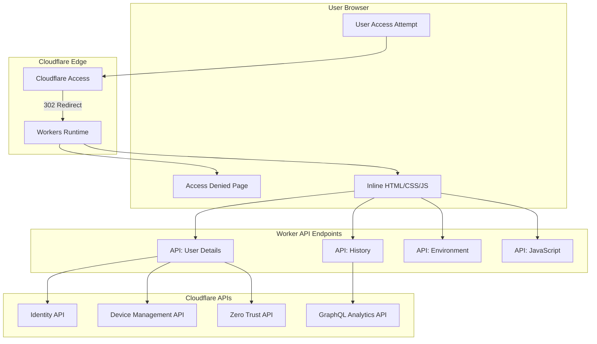

# 🛡️ Cloudflare Access Denied Information Page

[](https://workers.cloudflare.com/)
[](https://javascript.info/)
[](https://workers.cloudflare.com/)
[](https://www.gnu.org/licenses/gpl-3.0)

> **Note**: This project is based on and extends the original [cf-identity-dynamic](https://github.com/cloudflare/cf-identity-dynamic) repository by Cloudflare.

A professional, enterprise-grade access denied page built entirely with **Cloudflare Workers** that provides enriched user feedback and comprehensive device posture information. This solution dynamically fetches user identity data and presents it in a modern, S-Tier design system compliant interface.

## ⚠️ Important Notice

**This project is currently work in progress.** The current version has been tested and works with:

- ✅ **Windows machines** - Full device posture and compliance monitoring
- ✅ **macOS machines** - Complete device information and security checks
- ✅ **OKTA as Identity Provider** - Using SAML authentication

Other operating systems and identity providers may have limited functionality or require additional configuration.

<div align="center">
  
  <p><em>Modern access denied page with real-time user and device information</em></p>
</div>

## ✨ Features

- 🔐 **Real-time WARP Status** - Live WARP connectivity detection and organization verification
- 🏢 **Organization Membership** - Validates user organization assignment with visual indicators
- 🔑 **Device Posture Monitoring** - Complete device compliance and security posture checks
- 👥 **Group Management** - Identity provider group information and special group notifications
- 📱 **Comprehensive Device Info** - Detailed device model, OS version, and browser details
- 📊 **Access History** - Recent login attempts and failure analysis via GraphQL
- 🎨 **Professional Design System** - S-Tier UI with semantic colors, consistent typography, and accessibility
- ⚡ **Lightning Fast** - Single Worker deployment with 3ms startup time
- 🔒 **Security Hardened** - Comprehensive security headers and CORS protection
- 🚀 **Zero Build Dependencies** - Inline HTML/CSS/JS solution bypassing static asset issues

## 🏗️ Architecture



## 🚀 Quick Start

### Prerequisites

1. **Cloudflare Account** with Zero Trust enabled
2. **API Token** with comprehensive permissions (see below)
3. **Node.js** 18+ and npm
4. **Wrangler CLI** installed globally (`npm install -g wrangler`)

### Installation

1. **Clone and setup**
   ```bash
   git clone https://github.com/macharpe/cloudflare-access-denied-info-page.git
   cd access-denied-info-page
   npm install
   ```

2. **Configure Wrangler**
   ```bash
   # Edit wrangler.jsonc with your settings
   cp wrangler.jsonc.example wrangler.jsonc
   ```

3. **Set up API Token**
   ```bash
   wrangler secret put BEARER_TOKEN
   # Enter your API token when prompted
   ```

4. **Deploy**
   ```bash
   wrangler deploy
   ```

## 🔑 API Token Configuration

Create a **Custom Token** in your Cloudflare dashboard with these **exact permissions**:

### Required Permissions

| **Resource Type** | **Permission** | **Purpose** |
|---|---|---|
| **Access: Device Posture** | Read | Device compliance and posture information |
| **Access: Audit Logs** | Read | **CRITICAL** - Powers login history via GraphQL queries |
| **Zero Trust** | Read | WARP device details and connection status |
| **Access: Apps and Policies** | Read | Resolves application names from Access application IDs |

### Token Setup

1. **Cloudflare Dashboard** → [API Tokens](https://dash.cloudflare.com/profile/api-tokens)
2. **Create Token** → **Custom token**
3. **Add Permissions**:
   ```
   Account → Access: Device Posture → Read
   Account → Access: Audit Logs → Read
   Account → Zero Trust → Read
   Account → Access: Apps and Policies → Read
   ```
4. **Select Account** → Choose your Cloudflare account
5. **Create and Copy** the generated token
6. **Add to Worker**:
   ```bash
   wrangler secret put BEARER_TOKEN
   ```

### ⚠️ Troubleshooting

| Issue | Missing Permission |
|-------|-------------------|
| "Unknown App" in history | `Access: Apps and Policies` read |
| No device information | `Access: Device Posture` or `Zero Trust` read |
| No login history / 500 errors | `Access: Audit Logs` read |
| General 500 errors | Token expired or insufficient permissions |

## ⚙️ Configuration

### Worker Configuration (`wrangler.jsonc`)

```jsonc
{
  "name": "access-denied-info-page",
  "account_id": "your-account-id",
  "workers_dev": false,
  "main": "src/main.js",
  "routes": [
    {
      "pattern": "denied.yourdomain.com",
      "custom_domain": true
    }
  ],
  "vars": {
    "CORS_ORIGIN": "https://denied.yourdomain.com",
    "ACCOUNT_ID": "your-account-id",
    "ORGANIZATION_NAME": "YourOrg",
    "TARGET_GROUP": "SpecialGroup",
    "DEBUG": "false",
    "SUPPORT_EMAIL": "support@yourdomain.com",
    "PRIMARY_COLOR": "#3498db",
    "SECONDARY_COLOR": "#2ecc71"
  },
  "observability": {
    "enabled": true
  }
}
```

### Environment Variables

| Variable | Purpose | Example |
|----------|---------|---------|
| `ACCOUNT_ID` | API requests and org verification | `6b3bd3e4a3c3f11b51c67f98641a8688` |
| `ORGANIZATION_NAME` | Display name in UI | `YourCompany` |
| `CORS_ORIGIN` | CORS allowed origin | `https://denied.yourdomain.com` |
| `TARGET_GROUP` | Special group to highlight | `Administrators` |
| `DEBUG` | Enable debug mode | `false` (production) |
| `SUPPORT_EMAIL` | Support contact | `support@yourdomain.com` |
| `PRIMARY_COLOR` | Primary theme color | `#3498db` |
| `SECONDARY_COLOR` | Secondary theme color | `#2ecc71` |

## 📚 API Endpoints

The Worker exposes these internal endpoints:

| Endpoint | Method | Description | Response |
|----------|--------|-------------|----------|
| `/` | GET | Main page with inline HTML/CSS/JS | HTML |
| `/api/js` | GET | Dynamic JavaScript application code | JavaScript |
| `/api/userdetails` | GET | Combined identity, device, and posture data | JSON |
| `/api/history` | GET | Recent access failures via GraphQL | JSON |
| `/api/env` | GET | Environment vars and theme configuration | JSON |

## 🧩 Application Structure

### Single Worker Architecture

```
src/
└── main.js                 # Complete Cloudflare Worker
    ├── Event Listeners     # Route handling
    ├── CORS Management     # Dynamic origin handling
    ├── API Endpoints       # User data, history, env
    ├── Inline HTML         # Complete page with embedded CSS/JS
    └── JavaScript API      # Dynamic UI components
```

### Key Functions

- **`serveInlineHTML()`** - Serves complete page with embedded assets
- **`handleJavaScript()`** - Dynamic JavaScript with S-Tier design components
- **`handleUserDetails()`** - Aggregates identity, device, and posture data
- **`handleHistoryRequest()`** - GraphQL-powered access failure history
- **`getCorsHeaders()`** - Dynamic CORS for subdomain support

## 🔧 Development

### Local Development
```bash
# Install dependencies
npm install

# Start development server
wrangler dev
```

### Production Deployment
```bash
# Deploy to Cloudflare
wrangler deploy
```

## 🤝 Contributing

1. Fork the repository
2. Create feature branch (`git checkout -b feature/AmazingFeature`)
3. Commit changes (`git commit -m 'Add AmazingFeature'`)
4. Push branch (`git push origin feature/AmazingFeature`)
5. Open Pull Request

## 🙏 Acknowledgments

This project is based on and extends the original [cf-identity-dynamic](https://github.com/cloudflare/cf-identity-dynamic) repository by Cloudflare.

**Key Technologies:**
- [Cloudflare Workers](https://workers.cloudflare.com/) - Serverless compute platform
- [Cloudflare Access](https://www.cloudflare.com/zero-trust/products/access/) - Zero Trust access control
- [Cloudflare GraphQL API](https://developers.cloudflare.com/analytics/graphql-api/) - Analytics and audit logs

## 🗺️ Roadmap

### Planned Improvements

- **🔍 Enhance OS Detection** - Current OS detection logic is not robust and relies on hardcoded version patterns. Plan to implement multi-layered detection with confidence scoring, user-agent analysis, and future-proof pattern matching.

## 📝 License

This project is licensed under the GPL-3.0 License - see the [LICENSE](LICENSE) file for details.

---

<div align="center">
  <p><strong>Built with ❤️ for Cloudflare Zero Trust</strong></p>
  <p>🚀 <em>Enterprise-grade • Security-first • Performance-optimized</em></p>
  <p><a href="#-cloudflare-access-denied-information-page">⬆️ Back to top</a></p>
</div>
